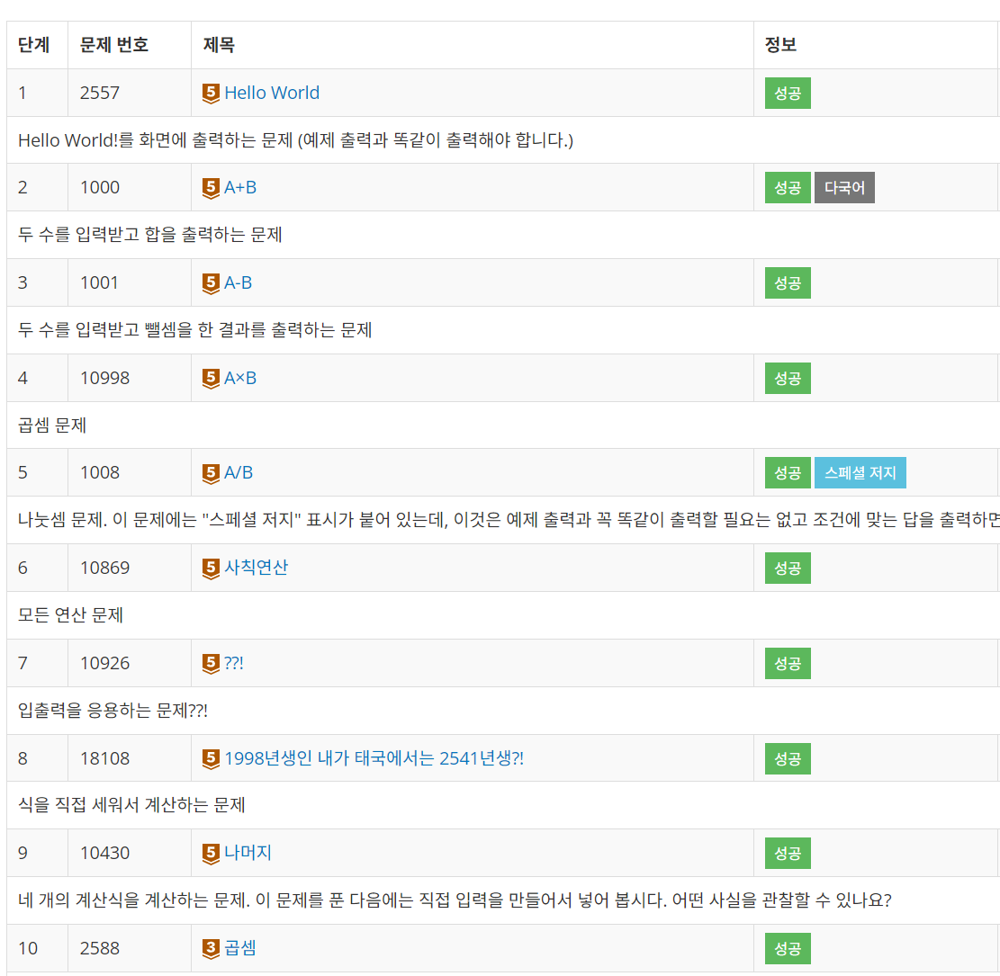

# 백준 1단계

### **theme** - 입출력과 사칙연산

문제 1 ~ 4 까지는 Scanner로 입력받고, 연산 후 출력하는 방식이라 기록할 게 없다..! (6,8번도)

<hr>
### ✅ 문제 5 _ A / B 구하기

**문제**

두 정수 A와 B를 입력받은 다음, A/B를 출력하는 프로그램을 작성하시오.

**필요개념**

int형의 나눗셈은 소수점이 출력되지 않음! 딱 값만 출력된다.

따라서 답을 double형으로 강제 변환시킨 후 출력한다.

**정답코드**

```java
import java.util.*;

public class Main {
    public static void main(String[] args) {
        Scanner sc = new Scanner(System.in);

        int A = sc.nextInt();
        int B = sc.nextInt();

        double ans = (double) A / B;

        System.out.println(ans);
    }
}
```

---

### ✅ 문제 7 \_ ??!

**문제**

준하는 사이트에 회원가입을 하다가 joonas라는 아이디가 이미 존재하는 것을 보고 놀랐다. 준하는 놀람을 ??!로 표현한다. 준하가 가입하려고 하는 사이트에 이미 존재하는 아이디가 주어졌을 때, 놀람을 표현하는 프로그램을 작성하시오.

**필요개념**

문자열을 스캐너로 받을 때에는 **sc.next()**를 사용한다!

**정답코드**

```java
import java.util.*;

public class Main {
    public static void main(String[] args) {
        Scanner sc = new Scanner(System.in);

        String A = sc.next();
        System.out.println(A + "??!");
    }
}
```

---

**1단계 1~10번 풀이 완료 🎶**
<br>


