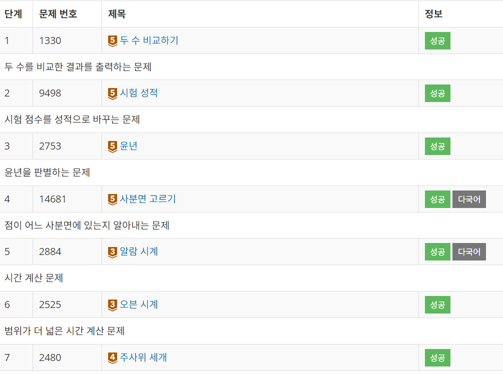

# 백준 2단계

### **theme** - 조건문

기록할 거 없는 문제 : 2,4,6,7

<hr>

### ✅ 문제 1 \_ 두 수 비교하기

**문제**

두 정수 A와 B가 주어졌을 때, A와 B를 비교하는 프로그램을 작성하시오.

**필요개념**

같을 때 ==를 출력해야 하기 때문에, 변수를 String으로 설정해줘야 한다! String은 큰 따옴표 사용해야 한다.

if/else를 길게 쓰기 귀찮아서 삼항연산자를 사용했다.

**정답코드**

```java
import java.util.Scanner;
public class Main {
    public static void main(String[] args) {
        Scanner sc = new Scanner(System.in);

        int A = sc.nextInt();
        int B = sc.nextInt();
        String ans;

        ans = A > B ? ">" : "<";
        if (A == B) ans = "==";

        System.out.println(ans);
    }
}
```

---

### ✅ 문제 3 \_ 윤년

**문제**

연도가 주어졌을 때, 윤년이면 1, 아니면 0을 출력하는 프로그램을 작성하시오.

윤년은 연도가 4의 배수이면서, 100의 배수가 아닐 때 또는 400의 배수일 때이다.

예를 들어, 2012년은 4의 배수이면서 100의 배수가 아니라서 윤년이다. 1900년은 100의 배수이고 400의 배수는 아니기 때문에 윤년이 아니다. 하지만, 2000년은 400의 배수이기 때문에 윤년이다.

**필요개념**

윤년 조건을 참고해서 삼항연산자로 코드를 작성했다. if문으로 썼을 때 코드가 길어진 기억이 있어서,,!

**정답코드**

```java
import java.util.Scanner;
public class Main {
    public static void main(String[] args) {
        Scanner sc = new Scanner(System.in);

        int A = sc.nextInt();
        int ans = (A % 4 == 0 && A % 100 != 0) || (A % 400 == 0) ? 1 : 0;
        System.out.println(ans);
    }
}
```

---

### ✅ 문제 5 \_ 알람 시계

**문제**

이 방법은 단순하다. 원래 설정되어 있는 알람을 45분 앞서는 시간으로 바꾸는 것이다. 어차피 알람 소리를 들으면, 알람을 끄고 조금 더 잘 것이기 때문이다. 이 방법을 사용하면, 매일 아침 더 잤다는 기분을 느낄 수 있고, 학교도 지각하지 않게 된다.

현재 상근이가 설정한 알람 시각이 주어졌을 때, 창영이의 방법을 사용한다면, 이를 언제로 고쳐야 하는지 구하는 프로그램을 작성하시오.

**필요개념**

신경써야 할 조건은 m이 45분보다 작을 때, h가 0이고 m이 45보다 작을 때여서 그 부분을 참고해 코드 작성했다.

개념은 그냥 조건문을 사용했다.

**정답코드**

```java
import java.util.Scanner;
public class Main {
    public static void main(String[] args) {
        Scanner sc = new Scanner(System.in);

        int h = sc.nextInt();
        int m = sc.nextInt();

        if (m >= 45) m -= 45;
        else {
            if (h == 0) h = 23;
            else h--;
            m += 15;
        }

        System.out.println(h + " " + m);

    }
}
```

---

**2단계 문제 전체 풀이 완료 🌱**

