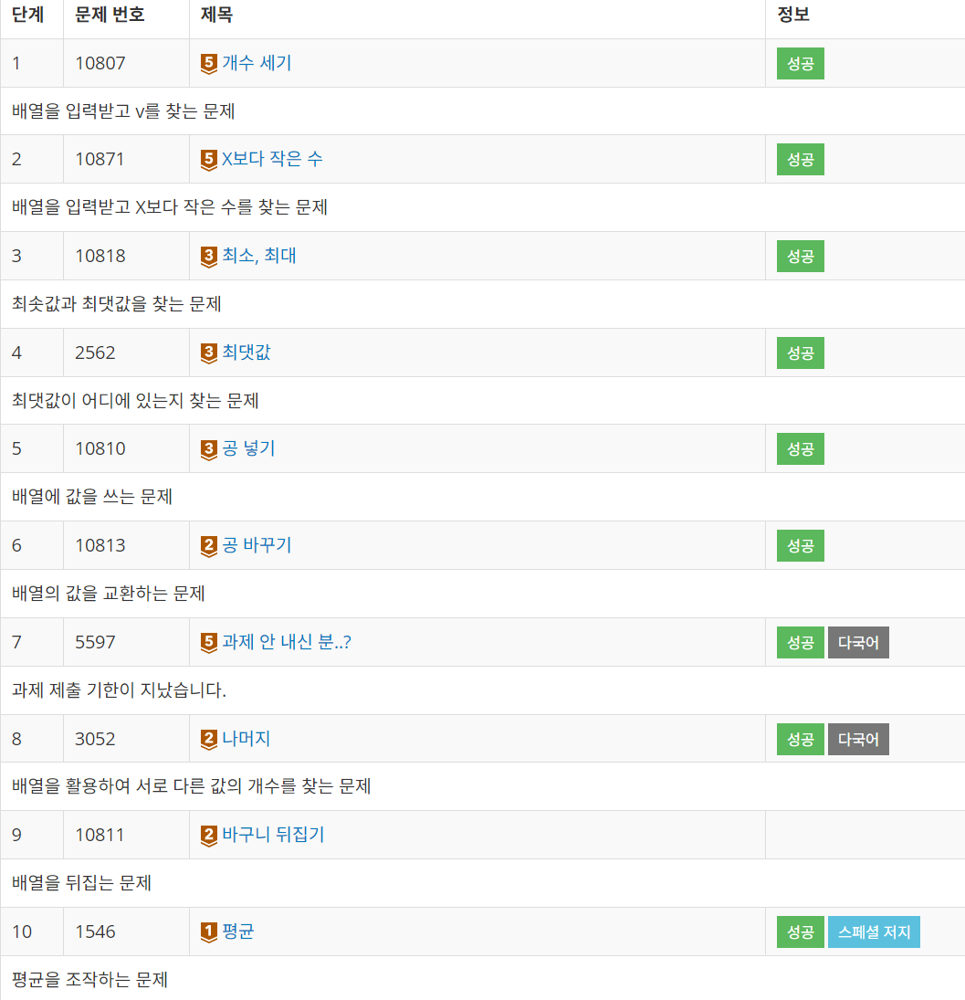

# 백준 4단계

### **theme** - 1차원 배열 → 얼떨결에 stream 연습 구간이 되었다 😎

기록할 거 없는 문제 : 2, 4, 5, 7

<hr>

### ✅ 문제 1 \_ 개수 세기

**문제**

총 N개의 정수가 주어졌을 때, 정수 v가 몇 개인지 구하는 프로그램을 작성하시오.

**필요개념**

사실 입력용 for문, 출력용for문을 사용하면 금방 풀 수 있지만, 공부했던 **Stream**을 사용해보았다!

배열은 스트림을 직접 생성할 수 없으므로 **Arrays.stream()**을 사용해서 생성해주었고, **filter()**를 통해 조건에 맞게 필터링을 했다.

스트림을 이용하니까 코드 길이가 확실히 적어져서 좋았다!

**정답코드**

- 스트림을 이용한 풀이

```java
import java.util.*;

public class Main {
    public static void main(String[] args) {
        Scanner sc = new Scanner(System.in);

        int size = sc.nextInt();
        int[] arr = new int[size];

        for (int i = 0 ; i < size ; i++) {
            arr[i] = sc.nextInt();
        }
        int same = sc.nextInt();
        System.out.print(Arrays.stream(arr).filter(i -> i == same).toArray().length);
    }
}
```

- for문을 이용한 풀이

```java
import java.util.*;

public class Main {
    public static void main(String[] args) {
        Scanner sc = new Scanner(System.in);

        int size = sc.nextInt();
        int[] arr = new int[size];

        for (int i = 0 ; i < size ; i++) {
            arr[i] = sc.nextInt();
        }
        int same = sc.nextInt();
        int cnt = 0;

        for (int i = 0 ; i < size ; i++) {
            if (arr[i] == same) cnt++;
        }

        System.out.println(cnt);
    }
}
```

---

### ✅ 문제 3 \_ 최소, 최대

**문제**

N개의 정수가 주어진다. 이때, 최솟값과 최댓값을 구하는 프로그램을 작성하시오.

**필요개념**

for문이랑 max 변수 만들어서 if문 이용하면 구현 가능할 거 같지만 또 스트림을 이용했다.

자바의 스트림은 **max, min 메소드**를 지원해주기 때문! 메소드 이용 후에는 **getAsInt()**로 바꿔줘야 int형으로 리턴이 가능하다. (참고로 **max는 Optional 객체를 반환**한다.)

**정답코드**

```java
import java.util.*;
public class Main {
    public static void main(String[] args) {
        Scanner sc = new Scanner(System.in);
        int n = sc.nextInt();
        int[] arr = new int[n];

        for (int i = 0 ; i < n ; i++) {
            arr[i] = sc.nextInt();
        }
        System.out.print(Arrays.stream(arr).min().getAsInt() + " " + Arrays.stream(arr).max().getAsInt());
    }
}
```

---

### ✅ 문제 6 \_ 공 바꾸기

**문제**

도현이는 바구니를 총 N개 가지고 있고, 각각의 바구니에는 1번부터 N번까지 번호가 매겨져 있다. 바구니에는 공이 1개씩 들어있고, 처음에는 바구니에 적혀있는 번호와 같은 번호가 적힌 공이 들어있다.

도현이는 앞으로 M번 공을 바꾸려고 한다. 도현이는 공을 바꿀 바구니 2개를 선택하고, 두 바구니에 들어있는 공을 서로 교환한다.

공을 어떻게 바꿀지가 주어졌을 때, M번 공을 바꾼 이후에 각 바구니에 어떤 공이 들어있는지 구하는 프로그램을 작성하시오.

**필요개념**

바꿀 공의 숫자를 받아서 swap을 이용해주었다. swap은 간단해서 메소드를 구현해두었다.

배열을 [1,2,3,4,5]로 세팅할 필요가 있었는데, 이때는 **Arrays.setAll()** 메소드를 사용했다. 첫 인수로 배열을 넣어주고, 두번째 인수로 람다 함수식을 넣어 간단히 작성할 수 있다!

**정답코드**

```java
import java.util.*;

public class Main {
    public static void swap(int a, int b, int[] arry) {
        int tmp;
        tmp = arry[a];
        arry[a] = arry[b];
        arry[b] = tmp;
    }
    public static void main(String[] args) {
        Scanner sc = new Scanner(System.in);

        int size = sc.nextInt();
        int n = sc.nextInt();
        int[] arr = new int[size];
        Arrays.setAll(arr, i -> i + 1);

        for (int i = 0 ; i < n ; i++) {
            int x = sc.nextInt();
            int y = sc.nextInt();
            swap(x - 1, y - 1, arr);

        }
        Arrays.stream(arr).forEach(System.out::println);
    }
}
```

---

### ✅ 문제 8 \_ 나머지

**문제**

두 자연수 A와 B가 있을 때, A%B는 A를 B로 나눈 나머지 이다. 예를 들어, 7, 14, 27, 38을 3으로 나눈 나머지는 1, 2, 0, 2이다.

수 10개를 입력받은 뒤, 이를 42로 나눈 나머지를 구한다. 그 다음 서로 다른 값이 몇 개 있는지 출력하는 프로그램을 작성하시오.

**필요개념**

어떻게 풀지 한참 고민하다가 문득 stream 메소드 중 **distinct() 메소드**가 떠올라서 사용했다!

distinct()는 중복을 제거해주는 메소드이고, 스트림을 반환하기 때문에 배열로 다시 바꾸어 배열의 길이를 출력했다.

고생해서 공부한 거 활용하니 뿌듯 x 1000 😊

**정답코드**

```java
import java.util.*;

public class Main {
    public static void main(String[] args) {
        Scanner sc = new Scanner(System.in);
        int[] arr = new int[10];
        for (int i = 0 ; i < 10 ; i++) {
            arr[i] = sc.nextInt() % 42;
        }
        System.out.println(Arrays.stream(arr).distinct().toArray().length);
    }
}
```

---

### ✅ 문제 10 \_ 평균

**문제**

세준이는 기말고사를 망쳤다. 세준이는 점수를 조작해서 집에 가져가기로 했다. 일단 세준이는 자기 점수 중에 최댓값을 골랐다. 이 값을 M이라고 한다. 그리고 나서 모든 점수를 점수/M\*100으로 고쳤다.

예를 들어, 세준이의 최고점이 70이고, 수학점수가 50이었으면 수학점수는 50/70\*100이 되어 71.43점이 된다.

세준이의 성적을 위의 방법대로 새로 계산했을 때, 새로운 평균을 구하는 프로그램을 작성하시오.

**필요개념**

최대값을 받은 후, 스트림을 이용해 ‘i / max \* 100’ 이라는 조건에 맞춰 값을 매핑해주었다. 이때, int로 하면 나누었을 때 원하는 값이 나오지 않을 수도 있으므로 **mapToDouble()** 메소드를 이용해 double타입으로 매핑해주었다!

**정답코드**

```java
import java.util.*;

public class Main {
    public static void main(String[] args) {
        Scanner sc = new Scanner(System.in);
        int size = sc.nextInt();
        int[] arr = new int[size];

        for (int i = 0 ; i < size ; i++) {
            arr[i] = sc.nextInt();
        }
        int max = Arrays.stream(arr).max().getAsInt();
        double sum = Arrays.stream(arr).mapToDouble(i -> (double) i / max * 100).sum();
        double avg = (double) sum / size;
        System.out.println(avg);
    }
}
```

---

**끝........😂**


